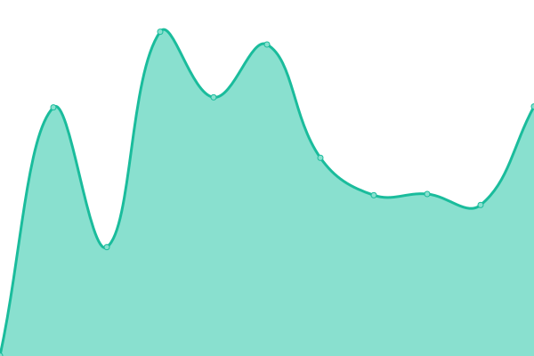

# [📈 Live Status](https://PhoenixR49.github.io/stormix-status-page): <!--live status--> **🟩 All systems operational**

This repository contains the open-source uptime monitor and status page for [Phoenix_R49](https://PhoenixR49.github.io/stormix-status-page), powered by [Upptime](https://github.com/upptime/upptime).

With [Upptime](https://upptime.js.org), you can get your own unlimited and free uptime monitor and status page, powered entirely by a GitHub repository. We use [Issues](https://github.com/PhoenixR49/stormix-status-page/issues) as incident reports, [Actions](https://github.com/PhoenixR49/stormix-status-page/actions) as uptime monitors, and [Pages](https://PhoenixR49.github.io/stormix-status-page) for the status page.

<!--start: status pages-->
<!-- This summary is generated by Upptime (https://github.com/upptime/upptime) -->
<!-- Do not edit this manually, your changes will be overwritten -->
<!-- prettier-ignore -->
| URL | Status | History | Response Time | Uptime |
| --- | ------ | ------- | ------------- | ------ |
|  [Stormix Website](https://stormixmusic.com) | 🟩 Up | [stormix-website.yml](https://github.com/PhoenixR49/stormix-status-page/commits/HEAD/history/stormix-website.yml) | 

 808ms
     
 | 

<a href="https://status.stormixmusic.com/history/stormix-website">100.00%</a>
    

|  [Stormix Smart Links](https://play.stormixmusic.com) | 🟩 Up | [stormix-smart-links.yml](https://github.com/PhoenixR49/stormix-status-page/commits/HEAD/history/stormix-smart-links.yml) | 

 652ms
     
 | 

<a href="https://status.stormixmusic.com/history/stormix-smart-links">100.00%</a>
    

|  [Stormix Bio](https://bio.stormixmusic.com) | 🟩 Up | [stormix-bio.yml](https://github.com/PhoenixR49/stormix-status-page/commits/HEAD/history/stormix-bio.yml) | 

 2181ms
     
 | 

<a href="https://status.stormixmusic.com/history/stormix-bio">100.00%</a>
    

<!--end: status pages-->

[**Visit our status website →**](https://PhoenixR49.github.io/stormix-status-page)

## 📄 License

- Powered by: [Upptime](https://github.com/upptime/upptime)
- Code: [MIT](./LICENSE) © [Phoenix_R49](https://PhoenixR49.github.io/stormix-status-page)
- Data in the `./history` directory: [Open Database License](https://opendatacommons.org/licenses/odbl/1-0/)
